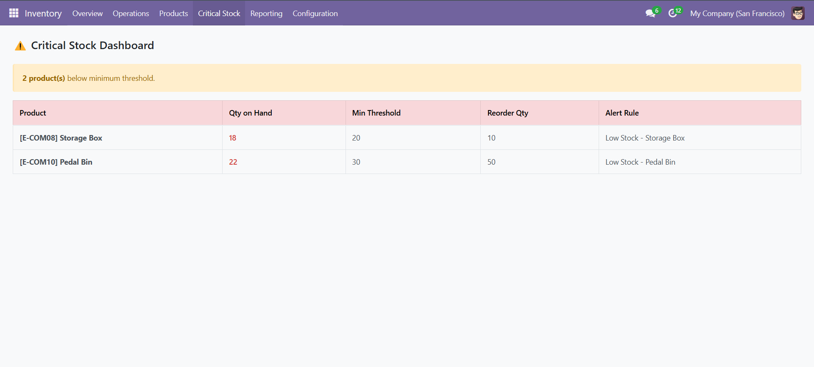

# stock_alert_reorder
 


 
A custom **Odoo 17** module that extends the default inventory management system with intelligent, configurable stock alerting, automated reorder rule generation, purchase order drafting, and a real-time OWL dashboard widget for critical stock visibility.
 
---
 
## 🚀 Features
 [static](static)
- **Per-product or per-category stock alert thresholds** — define minimum stock levels on a specific product or an entire product category via a dedicated `stock.alert.rule` model, giving warehouse managers flexible, fine-grained control
- **ORM-based stock detection** — batch queries against `stock.quant` using `read_group` detect all products at or below their threshold in a single database call, with no N+1 patterns
- **Idempotent cron job** — a scheduled action runs detection daily with built-in guards to prevent duplicate alert logs for the same product on the same day
- **Email notifications** — leverages Odoo's native `mail.thread` mixin and a custom email template to notify configured recipients when stock levels cross defined thresholds
- **Automated purchase order drafting** — when a critical stock item is detected, the module automatically creates a draft `purchase.order` assigned to the product's configured vendor, ready for review and confirmation
- **OWL dashboard widget** — a reactive, real-time dashboard component built with Odoo's OWL framework displays all products currently below their alert threshold, their current quantity, minimum threshold, and reorder quantity at a glance
---
 
## 🏗️ Technical Highlights
 
| Area | Implementation |
|---|---|
| **Data model** | Custom `stock.alert.rule` model with optional `many2one` to either `product.product` or `product.category`, supporting both product-level and category-level rules |
| **Stock detection** | Batch ORM queries against `stock.quant` using `read_group` with domain filters — no N+1 patterns |
| **Cron idempotency** | `stock.alert.log` tracks one log per rule + product combination per day, preventing duplicate alerts on repeated cron runs |
| **Email notifications** | `mail.thread` mixin with a custom email template — recipients configured per rule via a free-text email field |
| **PO automation** | Programmatic `purchase.order` + `purchase.order.line` creation via the ORM, with vendor resolved automatically from the product's `product.supplierinfo` |
| **OWL widget** | Reactive component using `useState` and `onWillStart` hooks, fetching data via Odoo's built-in ORM service (`useService("orm")`) with an RPC call to a custom Python method |
| **Security** | Full `ir.model.access` rules scoped to `stock` manager and user groups, with audit log deletion disabled for all groups |

---
 
## 📁 Module Structure
 
```
stock_alert_reorder/
├── __init__.py
├── __manifest__.py
├── data/
│   ├── ir_cron.xml                           # Scheduled action
│   └── mail_template.xml                     # Email notification template
├── models/
│   ├── __init__.py
│   ├── stock_alert_rule.py                   # Core alert rule model
│   └── stock_alert_log.py                    # Procurement action log
├── security/
│   └── ir.model.access.csv
├── static/
│   └── src/
│       ├── js/
│       │   └── stock_alert_dashboard.js      # OWL dashboard component
│       └── xml/
│           └── stock_alert_dashboard.xml     # OWL template
└── views/
    ├── stock_alert_rule_views.xml
    ├── stock_alert_log_views.xml
    └── stock_alert_dashboard_action.xml      # Dashboard action + menus
```
 
---
 
## ⚙️ Installation
 
**Prerequisites:** A running Odoo 17 instance with the `stock` and `purchase` apps installed.
 
1. Clone the repository into your Odoo addons directory:
   ```bash
   git clone https://github.com/AhmedEssammm/stock-alert-reorder.git
   ```
 
2. Restart the Odoo server and update the module:
   ```bash
   ./odoo-bin -c odoo.conf -u stock_alert_reorder
   ```
 
3. In Odoo, go to **Apps**, remove the "Apps" filter, search for `stock_alert_reorder`, and click **Install**.
---
 
## 🔧 Configuration
 
1. Navigate to **Inventory → Configuration → Stock Alert Rules**
2. Create a new rule and configure:
   - **Target** — choose either a specific **Product** or a **Product Category** (mutually exclusive — exactly one is required)
   - **Minimum Quantity** — stock level at or below which the alert triggers
   - **Reorder Quantity** — quantity to include in the auto-generated purchase order draft
   - **Alert Email** — comma-separated email addresses to notify when the alert fires (leave empty to skip email)
   - **Auto-Create PO** — enable to automatically draft a purchase order when stock is critical (vendor is resolved from the product's Purchase tab in Odoo)
   - **Stock Location** — optionally restrict the stock check to a specific warehouse location
3. The cron job runs daily by default — adjust the interval under **Settings → Technical → Automation → Scheduled Actions**
---
 
## 📊 Dashboard

Access the real-time stock alert dashboard from **Inventory → Critical Stock**.

The OWL widget displays:
- All products currently below their configured threshold
- Current on-hand quantity vs. minimum threshold
- Reorder quantity defined on the alert rule
- The alert rule name for full traceability
---
 
## 🧠 Design Decisions
 
A few intentional choices worth noting for anyone reviewing the code:

- **Extends, doesn't replace** — the module runs alongside Odoo's native replenishment system (`stock.warehouse.orderpoint`) rather than reimplementing it, adding the visibility and notification layer that the default system lacks
- **Flexible rule targeting** — rules can target a single product or an entire product category; category rules are expanded into concrete products at runtime, meaning new products added to a category are automatically covered on the next cron run
- **Idempotency first** — the cron job was designed with repeated execution in mind from the start; a date-based uniqueness check on `stock.alert.log` ensures running it twice produces the same outcome as running it once
- **Audit trail protection** — `stock.alert.log` records cannot be deleted by any group, including managers; this is enforced at both the ORM level (`perm_unlink = 0`) and the UI level (`delete="false"` on views)
- **Security as architecture** — access rules were defined before views, not after, to ensure the permission model drove the UI design rather than the other way around
- **Vendor resolution** — purchase orders read the vendor automatically from Odoo's native `product.supplierinfo`, respecting the preferred vendor priority already configured by the purchasing team rather than duplicating that configuration on the alert rule
---
 
## 👨‍💻 Author
 
**Ahmed Essam** — Computer Science Graduate | Odoo 17 Developer  
[LinkedIn](https://linkedin.com/in/ahmed-essam-khalifa) · [GitHub](https://github.com/AhmedEssammm)
 
---
 
## 📄 License
 
This module is licensed under the [GNU Lesser General Public License v3.0](LICENSE).  
It follows the same license as the Odoo Community codebase.
